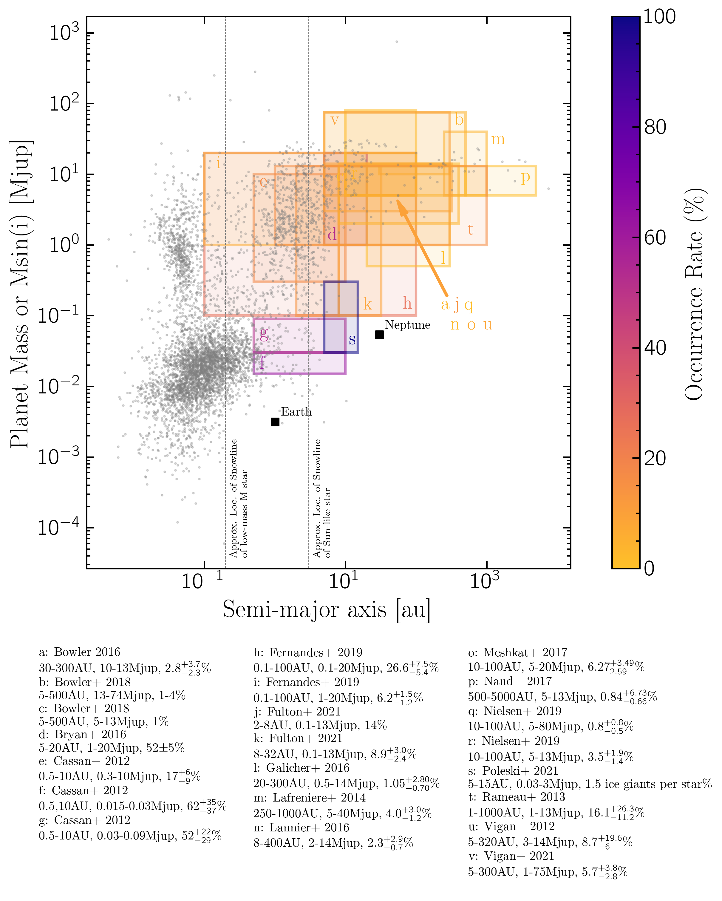

# Exoplanet Occurrence Rates

Everyone knows the obligatory semi-major axis vs mass plot that every exoplanet scientist is required by law to show in every talk. 
We wondered how literature occurrence rates would look overlaid on this plot. So we made it.  

This python script produces the plot below.
The hard work of compiling the literature was done by <a href="https://www.linkedin.com/in/r-bowens-rubin-4402bb149/">Rachel Bowens-Rubin</a> 
<a href="www.loganpearcescience.com">Logan Pearce</a> made the plot pretty. 
If you use it please give credit! 

